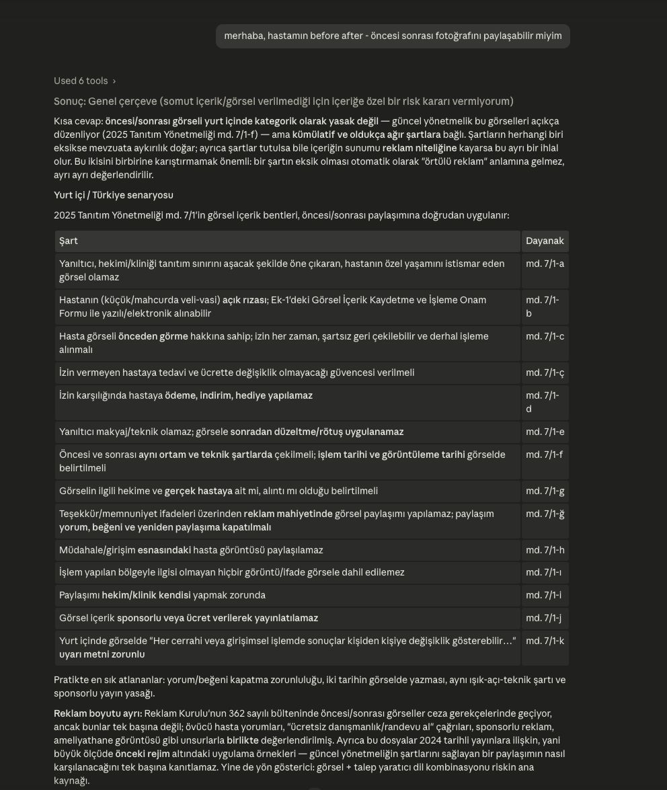
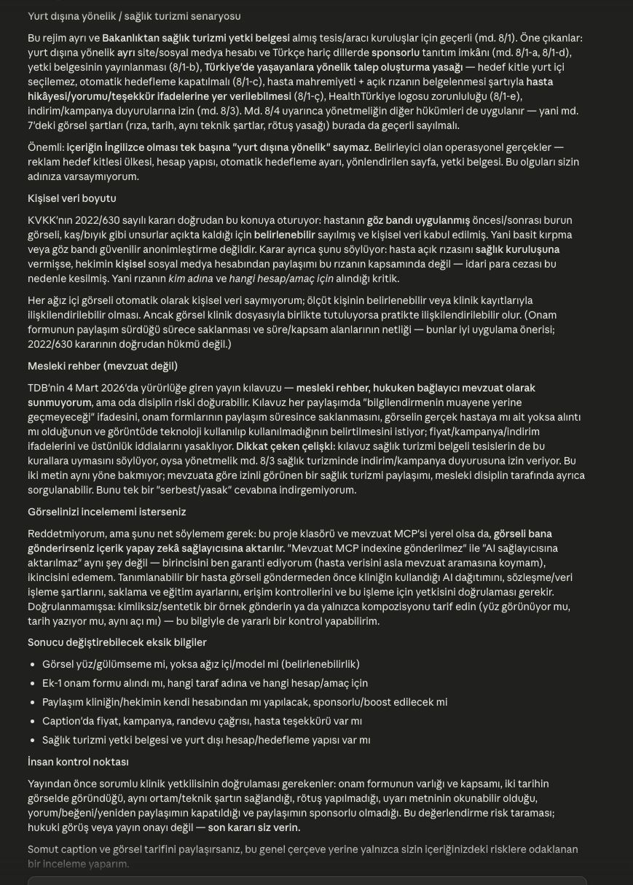

# Diş Mevzuat

Türkiye'de sağlık ve diş kliniği tanıtım/bilgilendirme içeriklerini kaynaklara göre
incelemek için hazırlanmış yerel bir FastMCP sunucusu ve örnek içerik inceleme skill'i.

Proje hukuki görüş veya yayın izni üretmez. MCP ilgili kaynak metinlerini getirir;
değerlendirme yapay zekâ tarafından kaynaklara dayanarak yapılır ve son karar insanda kalır.

## Hazır gelenler

- 15 kaynak ve 667 metin parçası içeren hazır SQLite arama indeksi
- Sağlık tanıtımı, diş hekimliği, KVKK ve sağlık turizmi kaynakları
- SQLite FTS5 ile API anahtarı gerektirmeyen yerel arama
- İsteğe bağlı semantik arama
- `skills/review-dental-content` altında Claude Code/Codex uyumlu inceleme skill'i
- Claude Code ve Codex için proje kapsamlı, salt-okunur MCP ayarları
- Claude, Codex, Cursor ve Copilot gibi ajanlar için ortak proje talimatları ve bağlamı
- Kaynak güncelleme ve yeni kaynak ekleme araçları

Hazır indeks 14 Temmuz 2026 tarihli bir kaynak anlık görüntüsüdür. Güncel ve bağlayıcı
metin için sonuçlarda belirtilen resmî kaynak bağlantısı ayrıca kontrol edilmelidir.

## En kolay kurulum: Python ile lokal

Python 3.11 veya üzeri gerekir. Docker gerekmez.

```bash
git clone https://github.com/yigitcanural/dis-mevzuat.git
cd dis-mevzuat
python3 -m venv .venv
source .venv/bin/activate
python -m pip install -e .
dis-mevzuat status
```

`status` çıktısında 15 kaynak ve 667 parça görünüyorsa hazır indeks çalışıyor demektir.

### Lokal MCP sunucusunu çalıştırma

Stdio modu, Claude Code gibi istemcilerin sunucuyu gerektiğinde kendisinin başlatması içindir:

```bash
dis-mevzuat serve
```

Lokal HTTP modu istenirse:

```bash
DM_TRANSPORT=http DM_HOST=127.0.0.1 DM_PORT=8000 dis-mevzuat serve
```

HTTP adresi: `http://127.0.0.1:8000/mcp`

## Repoyu bir yapay zekâ projesi olarak açma

Kurulumdan sonra repo kökünü Claude Code, Codex, Cursor veya Copilot ile açabilirsiniz.
Gerekli proje bağlamı ve güvenli varsayılanlar Git ile birlikte gelir:

- `AGENTS.md`: bütün ajanlar için kanonik çalışma kuralları
- `CLAUDE.md`: aynı kuralları Claude Code'a yükleyen uyumluluk köprüsü
- `docs/PROJECT_CONTEXT.md`: konuşmalardan bağımsız, sürümlenen ortak proje hafızası
- `.mcp.json`: Claude Code'un yerel stdio MCP ayarı
- `.codex/config.toml`: Codex'in yerel stdio MCP ayarı
- `.claude/skills/` ve `.agents/skills/`: kanonik skill'e yönlendiren keşif katmanları

İlk açılışta istemci proje MCP ayarına güvenip güvenmediğinizi sorabilir. Dosyayı kontrol
ettikten sonra onaylayın. Her iki hazır ayar da yalnız salt-okunur araçları kullanır ve
`DM_ENABLE_ADMIN_TOOLS=false` ile çalışır. Önce `.venv` kurulmuş olmalıdır.

Claude Code'da `/mcp`, Codex'te `/mcp` komutuyla bağlantı durumunu görebilirsiniz. Bir
içerik incelemesi istediğinizde repo içindeki skill otomatik keşfedilir. Uygulamaların kendi
sohbet geçmişi veya otomatik hafızası yardımcı olabilir; fakat proje için kalıcı doğruluk
kaynağı Git'teki talimatlar ve `docs/PROJECT_CONTEXT.md` dosyasıdır.

## Başka bir Claude Code projesine bağlama

Diş Mevzuat'ı farklı bir Claude Code projesinde kullanacaksanız hedef projenin kökünde
`.mcp.json` oluşturun. Yolları kendi bilgisayarınıza göre mutlak yol olarak değiştirin:

```json
{
  "mcpServers": {
    "dis-mevzuat": {
      "type": "stdio",
      "command": "/TAM/YOL/dis-mevzuat/.venv/bin/dis-mevzuat",
      "args": ["serve"],
      "env": {
        "DM_DATA_DIR": "/TAM/YOL/dis-mevzuat/data",
        "DM_ENABLE_ADMIN_TOOLS": "false"
      }
    }
  }
}
```

Skill'i yalnız o projede kullanmak için kopyalayın:

```bash
mkdir -p /TAM/YOL/CLAUDE-PROJESI/.claude/skills
cp -R skills/review-dental-content /TAM/YOL/CLAUDE-PROJESI/.claude/skills/
```

Claude Code'u yeniden açtıktan sonra içerik incelemesi istendiğinde skill, MCP kaynaklarını
arka planda kullanır. Skill; Türkiye ve yurt dışı senaryolarını ayırır, mevzuata aykırılık ile
reklam niteliğini birbirine karıştırmaz ve son kararı insana bırakır.

## Örnek konuşma

“Hastamın öncesi/sonrası fotoğrafını paylaşabilir miyim?” sorusuna verilen tek bir kaynak
destekli yanıt, okunabilirlik için iki ekran görüntüsüne bölünmüştür:





## MCP araçları

Her zaman açık olan salt-okunur araçlar:

- `search_sources`
- `list_sources`
- `get_source`
- `get_chunk`
- `system_status`

`DM_ENABLE_ADMIN_TOOLS=true` olduğunda yalnız yerel kaynak yönetimi için eklenen araçlar:

- `preview_source`
- `preview_text_source`
- `approve_source`
- `check_source_update`
- `archive_source`

Kaynak ekleme iki aşamalıdır: önce önizleme, ardından açık onay. Bir URL'den gelen metin
doğrudan aktif indekse yazılmaz.

## Kaynakları güncelleme veya yeniden oluşturma

Hazır indeks sayesinde ilk kurulumda kaynak indirmek gerekmez. İndeksi resmî bağlantılardan
yeniden oluşturmak isterseniz önce mevcut veritabanını yedekleyin, ardından:

```bash
DM_ENABLE_ADMIN_TOOLS=true dis-mevzuat seed data/seed_sources.json
```

`data/seed_sources.json` kaynak başlıklarını, kurumları ve resmî bağlantıları içerir. Aynı
içerik ikinci kez eklenmez; değişen bir sürüm onaylandığında önceki sürüm arşivlenir.

## Semantik arama (isteğe bağlı)

Varsayılan FTS5 araması tamamen lokaldir ve API anahtarı kullanmaz. OpenAI uyumlu bir
embedding API etkinleştirilirse kelime ve semantik sonuçlar birleştirilir:

```bash
DM_EMBEDDING_API_KEY=...
DM_EMBEDDING_API_BASE=https://openrouter.ai/api/v1
DM_EMBEDDING_MODEL=openai/text-embedding-3-small
```

Embedding kullanıldığında indeksleme sırasında kaynak parçaları, arama sırasında ise sorgular
seçilen dış sağlayıcıya aktarılır. Hasta veya klinik verisi bu mevzuat indeksine, sorgulara ya
da embedding hizmetine gönderilmemelidir.

## Docker (isteğe bağlı)

Ana kurulum yöntemi değildir. Sürekli açık lokal HTTP servisi isteyenler için:

```bash
docker compose up -d --build
```

Servis yalnız `127.0.0.1:8000` üzerinde açılır. İnternete açmak için ayrıca HTTPS,
kimlik doğrulama, hız sınırlama ve operasyonel güvenlik gerekir.

## Güvenlik ve veri sınırı

- Hazır indeks kamuya açık hukuk ve mesleki kaynaklardan oluşur; kamuya açık bir belgenin
  kişisel veri içermeyeceği varsayılmamalıdır.
- Hasta fotoğrafı, hasta kaydı veya klinik iç verisi bu indekse eklenmemelidir.
- Kaynak ekleme araçları varsayılan olarak kapalıdır.
- URL alımı yalnız HTTP/HTTPS ve genel internet IP'leriyle sınırlıdır.
- Kaynak boyutu sınırlıdır; içerik özeti SHA-256 ile izlenir.
- Yapay zekâ istemcisinin veri işleme koşulları MCP'den ayrıdır ve ayrıca kontrol edilmelidir.

## Kaynak metinleri ve lisans

Proje kodu MIT lisanslıdır. Hazır indeks içindeki kaynak metinleri projeye ait değildir;
ilgili kurumların kamuya açık yayınlarından alınmıştır. Kaynak başlığı, kurum ve bağlantıları
`data/seed_sources.json` dosyasındadır. MIT lisansı üçüncü taraf kaynak metinlerine yeni bir
lisans vermez. Tereddüt halinde resmî bağlantıdaki güncel metin esas alınmalıdır.

## Test

```bash
python -m pip install -e ".[dev]"
python -m pytest
```
